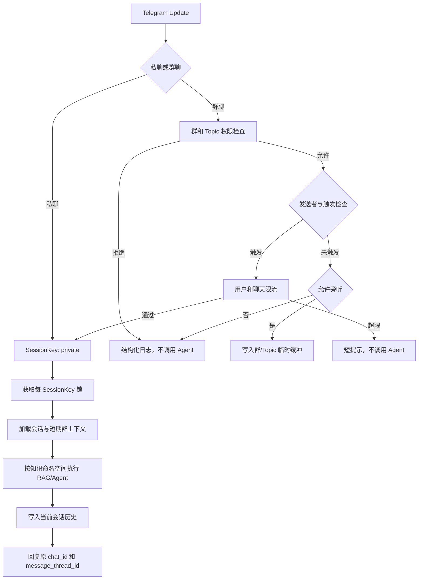

# AL1S 群聊设计

## 目标与边界

群聊支持建立在现有私聊、角色、RAG、图片和 MCP 能力之上。群消息必须先通过程序层策略，触发判断发生在数据库写入、RAG、Agent 和模型调用之前。私聊仍默认直接响应。

群聊旁听上下文是有界、带 TTL 的内存数据，不是长期记忆。默认不从群聊自动学习；启用群学习后也必须进入群或 Topic 命名空间，不能进入成员个人命名空间。

## 消息流程



权限顺序如下：

1. 识别私聊或群聊。
2. 检查群聊总开关。
3. `blocked_chat_ids` 优先拒绝。
4. 检查 `allowed_chat_ids`。
5. 检查 `ignored_thread_ids` 和 `allowed_thread_ids`。
6. 按配置忽略机器人发送者。
7. 检查触发条件或命令目标用户名。
8. 计算 `SessionKey`，再执行限流、上下文和 Agent 调用。

## 触发机制

`GroupChatService.decide` 产生 `TriggerDecision`，触发类型为：

- `private`：私聊直接触发。
- `mention`：Telegram `mention` 实体精确匹配当前机器人用户名，不区分大小写。
- `reply`：`reply_to_message.from_user.id` 等于当前 Bot ID。
- `wake_word`：消息命中当前群唤醒词，不区分大小写。
- `command`：无目标用户名或目标为当前机器人的命令。
- `unrestricted`：`require_mention = false` 时的普通群消息。
- `not_triggered`：未触发或被策略拒绝。

消息同时提及多个机器人时，只有实体中包含当前机器人用户名才触发。`/reset@OtherBot` 会被静默忽略。来自其他机器人的消息默认拒绝，以避免 Bot 循环。

## SessionKey

```python
@dataclass(frozen=True, slots=True)
class SessionKey:
    chat_id: int
    thread_id: int
    user_id: int
    scope: Literal["private", "per_user", "shared", "topic"]
```

| 模式 | chat_id | thread_id | user_id |
| --- | --- | --- | --- |
| 私聊 | 当前私聊 | `0` | 当前用户 |
| `per_user` | 当前群 | 当前 Topic 或 `0` | 当前用户 |
| `shared` | 当前群 | `0` | `0` |
| `topic` | 当前群 | 当前 Topic 或 `0` | `0` |

群共享键使用 `user_id = 0` 表示用户不是隔离维度，而不是通过字符串拼接隐藏规则。`/reset`、`/role` 和 `/stats` 均从同一策略服务计算当前键。

## 权限与管理员

群组和 Topic 的静态允许/拒绝列表来自 TOML。管理员身份通过 `get_chat_member(chat_id, user_id)` 判断 `creator` 或 `administrator`，并允许 `telegram.admin_user_ids` 中的全局管理员。

`/group_status` 及所有群配置修改命令都要求管理员权限。群配置命令可以在群运行期停用时执行，以便管理员重新启用；黑名单仍然优先。运行期覆盖存于内存，重启后恢复 TOML。

## Topic 隔离与发送

普通群统一将缺失的 Topic 视为 `0`。旁听缓冲、Topic 会话和 Topic 知识都以实际 `message_thread_id` 隔离。

所有新增发送路径显式传递原始 `message_thread_id`。引用回复失败时，文本主链路回退为同 Topic 普通消息；占位消息无法编辑时也回退为同 Topic 新消息。长回复以 4000 字符为上限拆分，避免超过 Telegram 单条消息限制。

## 群聊上下文缓冲

缓冲键为 `(chat_id, thread_id)`，值为 `deque(maxlen=context_buffer_size)`。每条记录只保留必要的标量字段：消息、用户、显示名、文本和时间戳；不会保存 `Update` 或其他 Telegram 对象。

读写由短时 `asyncio.Lock` 保护。读取和写入都会清理早于 `context_buffer_ttl` 的消息。当前触发消息不会重复写入旁听缓冲，而是作为当前用户消息单独传给 Agent。缓冲接口由 `observe/get_context/format_context` 组成，可替换为 Redis 实现。

## 长期记忆隔离

知识命名空间为：

- `private:{user_id}`
- `group:{chat_id}`
- `topic:{chat_id}:{message_thread_id}`

群长期学习默认关闭。关闭时群聊 Agent 不执行 RAG 检索，也不会调用学习服务。开启后，学习服务、SQLite 记录和向量元数据都携带群或 Topic 命名空间；检索结果按相同命名空间过滤。

LangChain Agent 的知识搜索工具原先没有请求级命名空间，因此群聊走隔离的简化 RAG 路径。私聊保留原 Agent/MCP 行为。后续若将命名空间下沉到全部 LangChain Tool Runtime，可恢复群聊的完整 Agent 工具路径。

## 并发与去重

`ConversationService` 为每个 `SessionKey` 维护独立 `asyncio.Lock`。同一会话的用户消息、Agent 响应、学习和 `/reset` 顺序执行；不同群或 Topic 可以并发。锁记录带最后使用时间，超过阈值时按需清理，避免无限增长。

Agent 的当前数据库会话 ID 使用 `ContextVar`，避免不同会话并发工具调用时互相覆盖。最近 Update ID 也使用带 TTL 的集合去重。

## 限流

`RateLimitService` 使用异步滑动窗口，同时检查用户和 `(chat_id, thread_id)`。只有通过触发判断的请求才消耗限流额度。被限流时不调用 Agent，并对同一维度的提示做短时间抑制，避免群内刷屏。

## 数据库迁移

启动时 `DatabaseService` 创建 `schema_migrations` 并执行幂等 v2 迁移：

1. 创建新 `conversations` 结构。
2. 将旧记录复制为 `private` 会话，保留原 ID、角色和时间。
3. 将唯一键改为 `(chat_id, thread_id, session_scope, session_owner_id)`。
4. 添加 `knowledge_namespace` 和相关索引。
5. 记录版本 `2`。

消息和工具调用继续引用保留的对话 ID。迁移在事务中执行，重复启动直接跳过。`data/migrations/002_group_chat_sessions.sql` 记录迁移范围，实际迁移由 Python 完成以便检查旧表状态。

## 安全与隐私

- 触发过滤不依赖系统提示词。
- 日志只记录 ID、作用域、触发、拒绝原因、Agent 调用状态和耗时，不记录完整对话或凭据。
- 旁听内容不写个人长期记忆，也不写 SQLite。
- Bot Token、API Key、Authorization Header 和 MCP 凭据不得进入缓冲或结构化日志。
- BotFather 隐私模式决定 Telegram 是否投递普通消息，AL1S 策略决定已投递消息是否可调用 Agent；两层都需要正确配置。
- 群知识学习是显式管理员选择，默认关闭。
